# Pavo


**Manifest Anything.**

Pavo is the Eidos capture CLI for Plaud recordings. Its first job is to prove
that Daniel's Plaud account can be reached, list recordings, obtain temporary
audio URLs, and download the real audio files for later upload to Google Drive.

## Why Pavo Exists

Pavo exists because Plaud alone was not enough for Eidos work. Plaud can capture
meetings and produce useful notes, but the product workflow did not give an
agent a durable, auditable path from the real recording to transcription
evidence, speaker evidence, dictionaries, and later reprocessing.

The target loop is:

```text
Plaud Cloud -> real audio -> local manifest -> eidos-transcribe -> better transcript -> durable archive
```

Pavo owns the capture and orchestration layer. `eidos-transcribe` owns the
installable audio-intelligence layer.

The problems we hit:

1. **Plaud notes were not enough.** We needed the real recording, not just a
   summary. Pavo saves the actual audio so better AI can listen again.
2. **The audio was hard to get.** The recording lived in Plaud Cloud behind app
   and tool layers. Pavo finds the recording and brings the audio onto the
   computer.
3. **The account was confusing.** The Plaud login did not look like a normal
   email address. Pavo shows which Plaud account is connected before it
   downloads anything.
4. **The AI tool path was flaky.** The Plaud MCP setup worked, but Codex could
   not always see it right away. Pavo keeps a simple command-line path that
   works even when tools are hidden.
5. **Links expired.** Plaud audio links are temporary and should not become the
   record. Pavo saves the file, the hash, and the manifest instead.
6. **Secrets needed boundaries.** We needed local settings without leaking
   tokens or private data. Pavo keeps settings under `~/Eidos/Pavo` and leaves
   secrets in their proper stores.
7. **Recordings needed a home.** Local cache is not enough for a durable
   archive. Pavo is being built to sync audio, notes, and manifests into Google
   Drive.
8. **AI misheard important words.** Names, companies, and Eidos tool names can
   sound like other words. `eidos-transcribe` lets Pavo pass known vocabulary so
   transcripts get smarter.
9. **One transcript was too fragile.** One AI model can miss things another
   model catches. `eidos-transcribe` can compare multiple engines and keep the
   evidence.
10. **Who spoke mattered.** Speaker labels are not the same as knowing the
    person. `eidos-transcribe` uses audio evidence and known speaker mappings to
    improve attribution.
11. **Messy audio needed help.** People interrupt, rooms are noisy, and speech
    overlaps. `eidos-transcribe` can flag messy regions and analyze them
    separately.
12. **The system needed to improve over time.** Pavo should not be rebuilt every
    time transcription gets better. Pavo calls `eidos-transcribe` as an
    installable package that can be upgraded.

## Problem -> Solution Cards

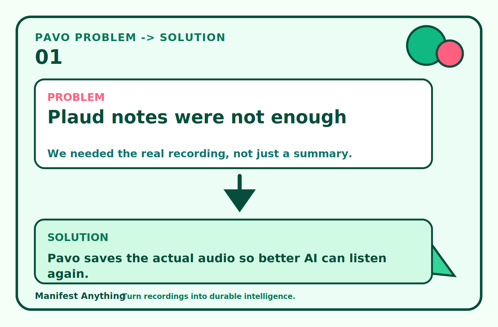

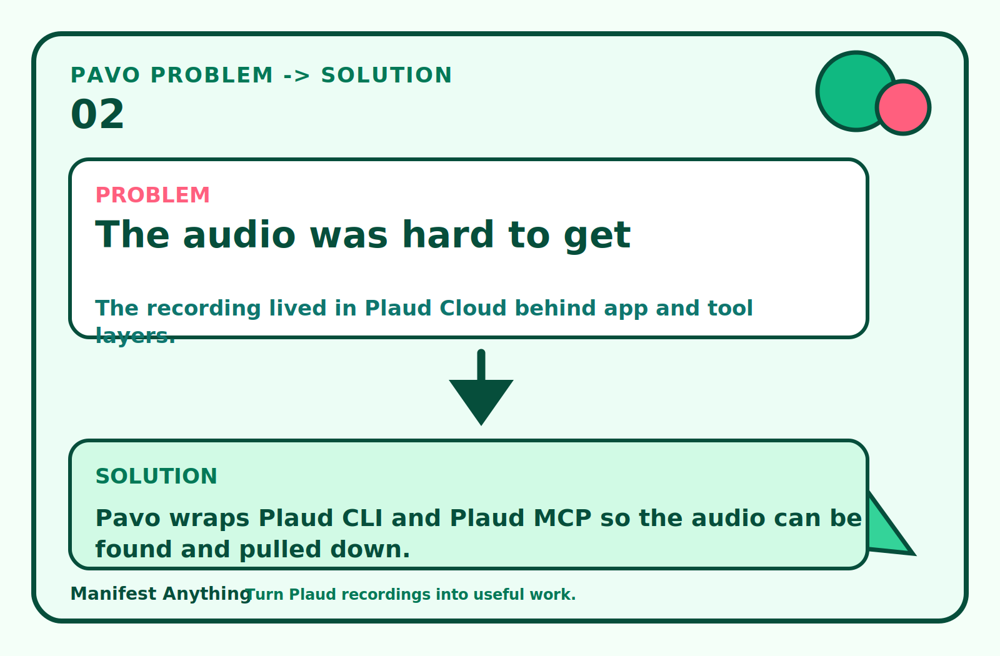

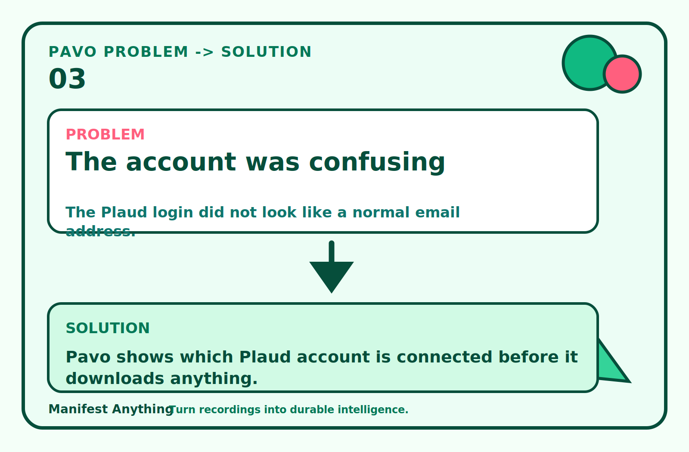

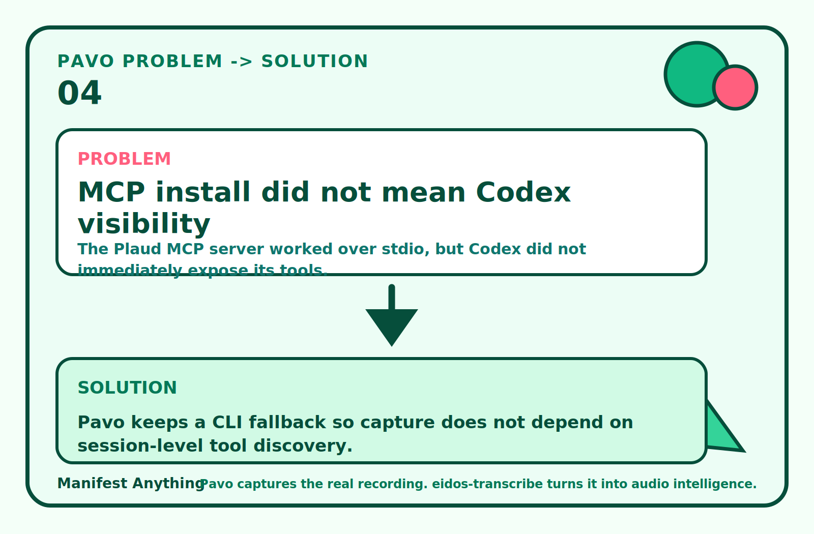

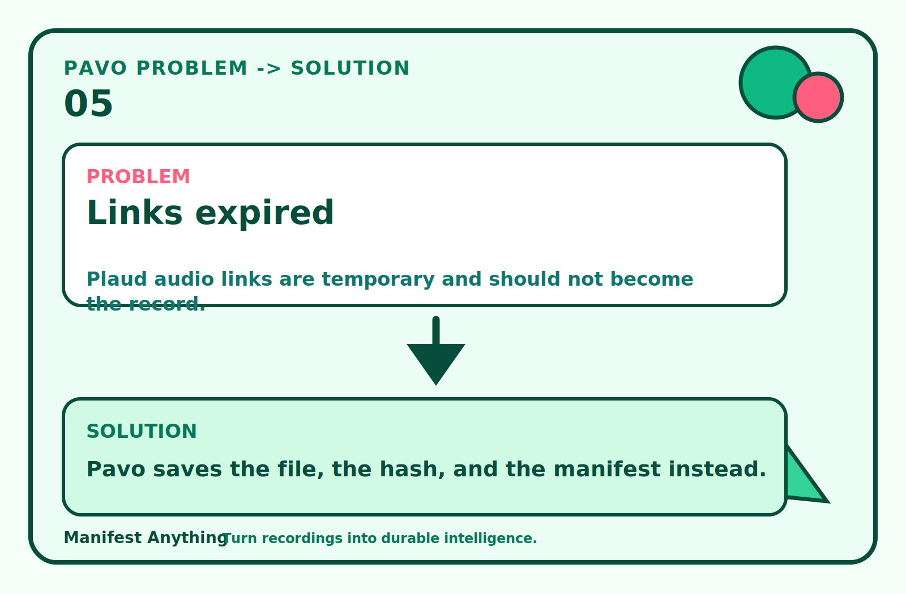

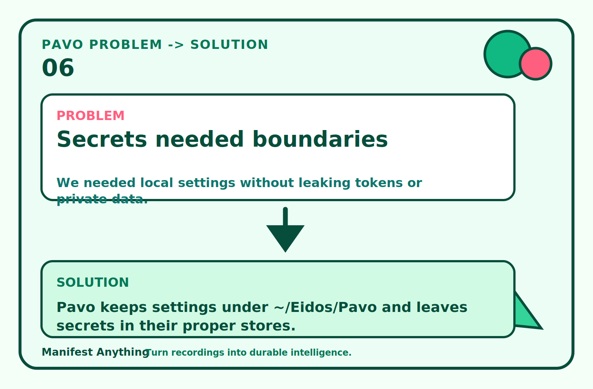

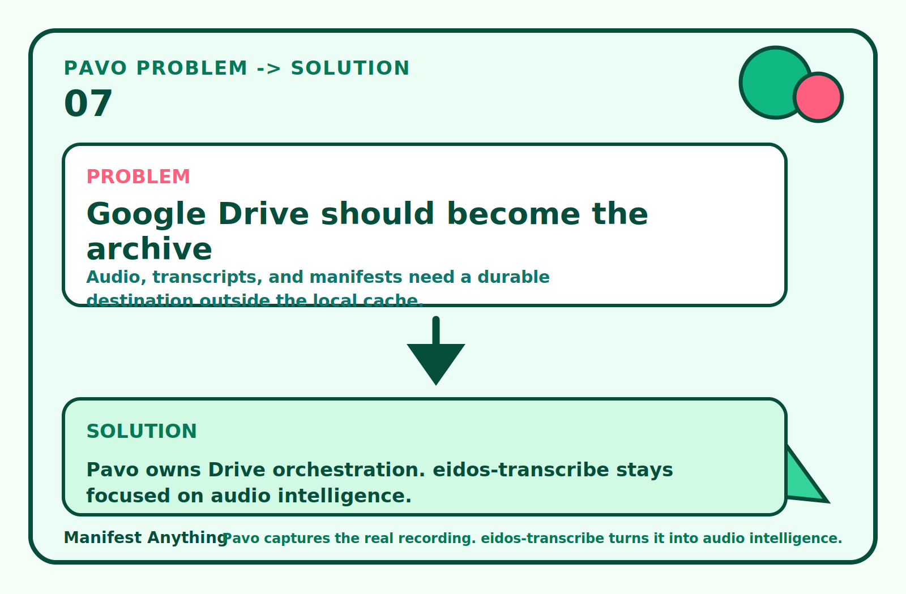

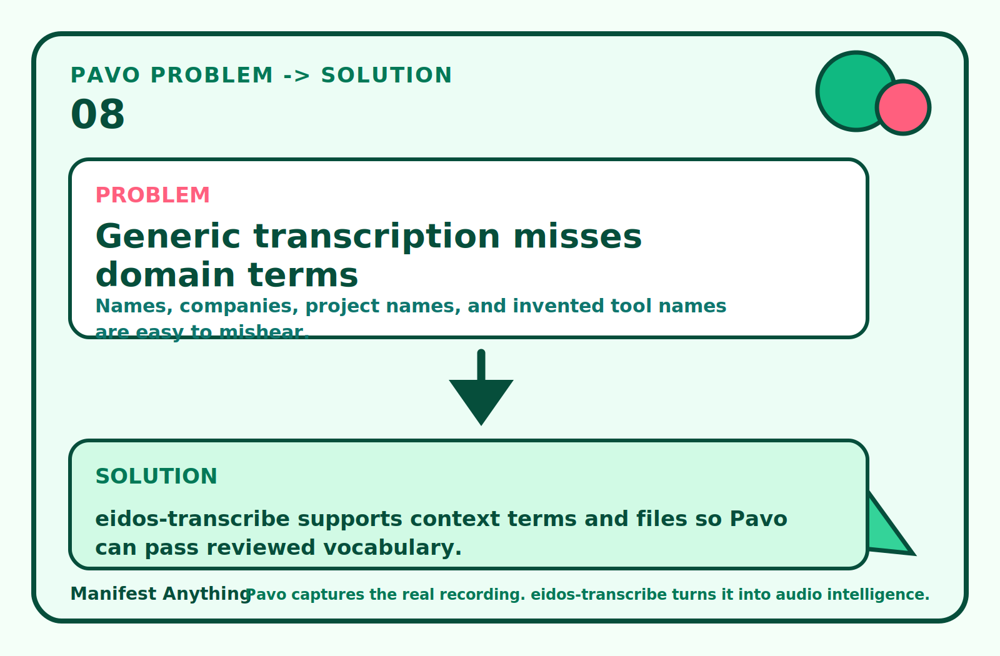

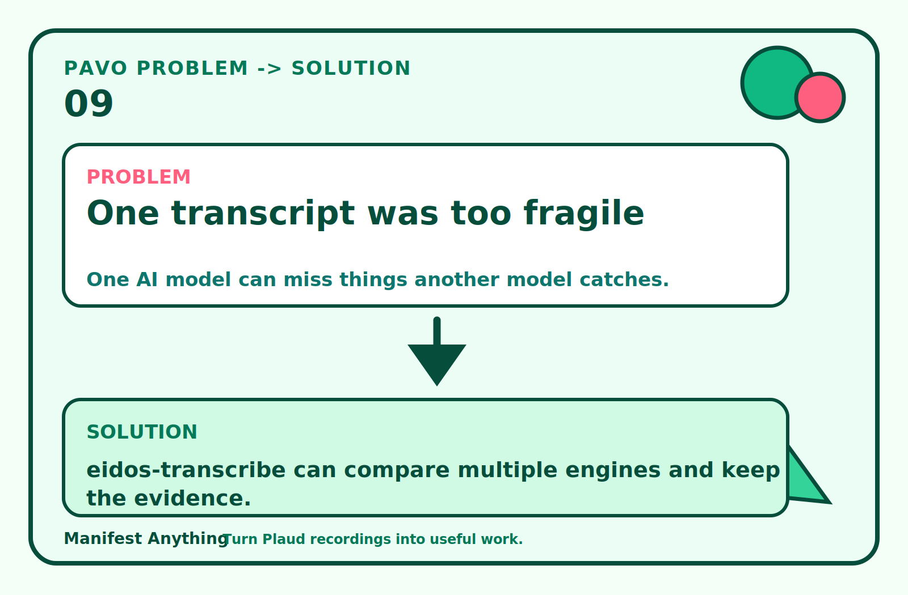

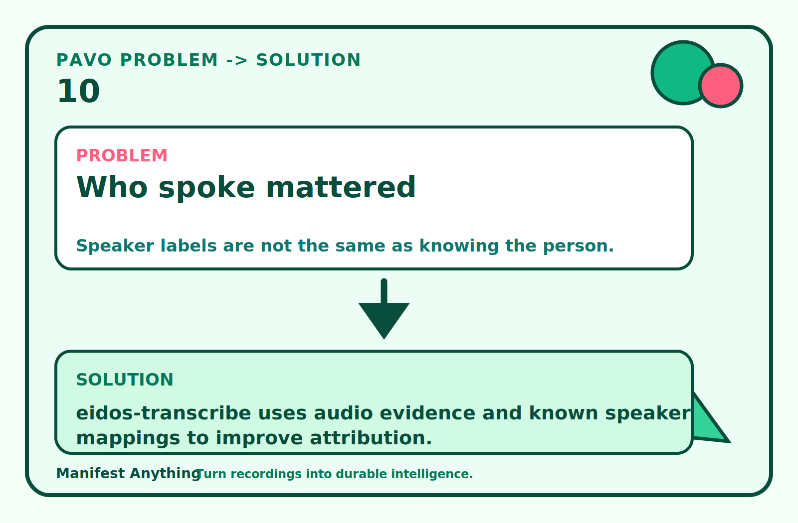

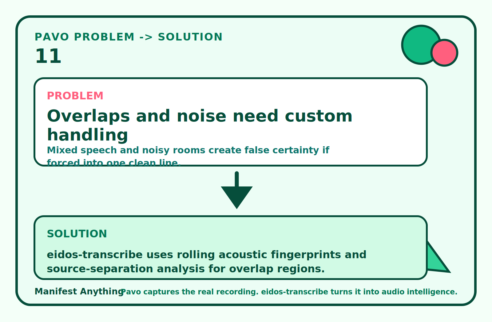

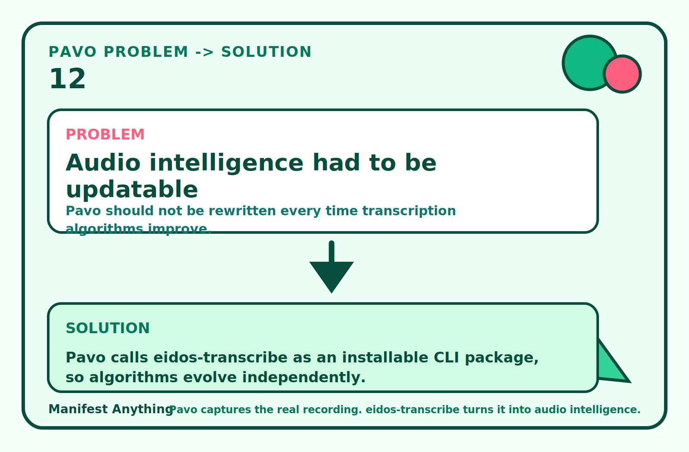

The short version:

- **Pavo solves:** Plaud discovery, real audio download, local cache/config,
  recording manifests, future Google Drive sync, and agent/plugin routing.
- **`eidos-transcribe` solves:** multi-engine transcription, context-aware
  scoring, raw-output preservation, transcript manifests, speaker diarization,
  speaker signatures, rolling acoustic fingerprints, overlap analysis, and
  future reprocessing as models and dictionaries improve.

Read the full [backstory](docs/backstory.md) for the longer version.

The original parrot scribe mascot is preserved at
[`assets/mascot.png`](assets/mascot.png).

Pavo stores local non-secret configuration under:

```text
~/Eidos/Pavo/
```

Secrets do not belong in Pavo config. Plaud OAuth tokens remain owned by the
Plaud CLI under `~/.plaud/`, and Google/OpenAI credentials remain in their
normal credential stores.

## Install for local development

```bash
python3 -m venv .venv
.venv/bin/python -m pip install -e .
ln -sf "$PWD/.venv/bin/pavo" ~/.local/bin/pavo
```

Install the Plaud CLI separately:

```bash
npm install -g @plaud-ai/cli
plaud login
```

## Commands

```bash
pavo init
pavo doctor
pavo config show
pavo plaud me
pavo plaud files
pavo plaud audio-url <recording-id>
pavo plaud download <recording-id>
pavo audio doctor
pavo transcribe <recording-id> --context-term Plaud
```

`pavo plaud download` writes the audio to
`~/Eidos/Pavo/cache/plaud/<recording-id>/audio.mp3` by default and prints its
SHA-256 hash.

`pavo transcribe` reuses that audio file if it already exists, or downloads it
first. It calls `eidos-transcribe` as a subprocess and writes the transcript
bundle under `~/Eidos/Pavo/cache/plaud/<recording-id>/transcribe/`. Pavo records
its own run manifest next to the audio as `pavo-transcribe-manifest.json`.

## Tests

```bash
python3 -m unittest discover -s tests
```
