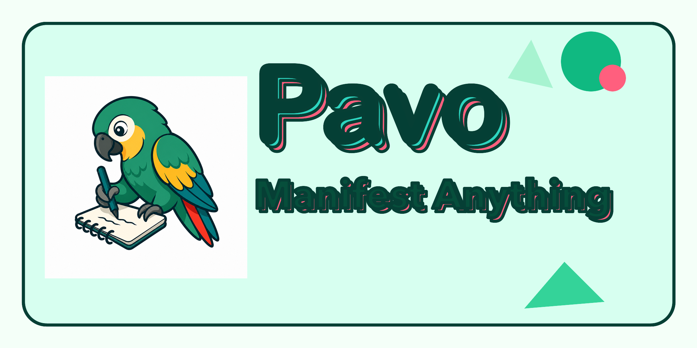
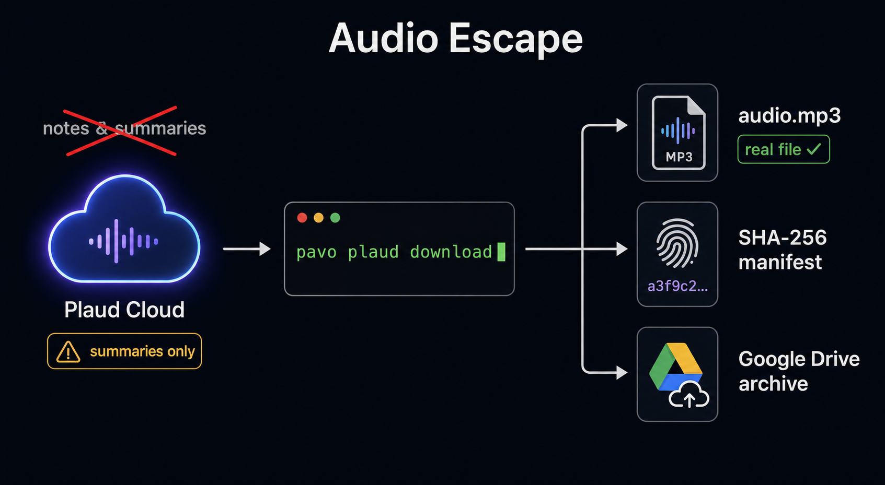
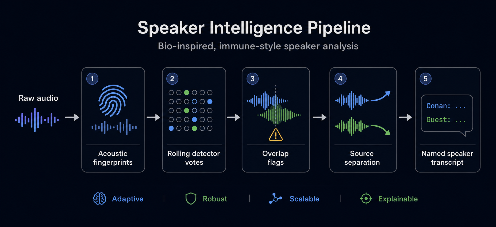
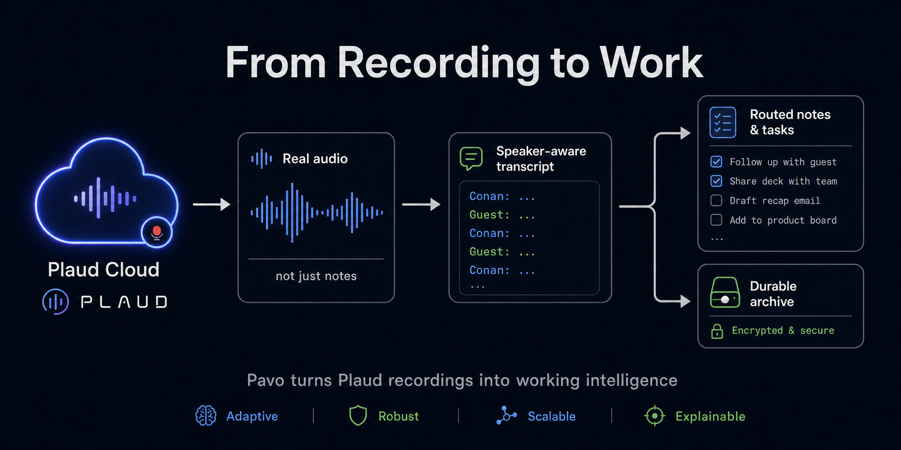

# Pavo



**Manifest Anything.**

Pavo is a data-science-led transcription workbench for teams that need
trustworthy records from messy audio. It was inspired by Plaud workflow gaps,
but it is not a Plaud-only tool: Pavo gives operators control over real audio
files, speaker identification, custom dictionaries per call, intelligent
routing, task creation, and durable archives.

Use it when the stock transcript is not enough and the team needs a repeatable
way to improve the audio, prove who spoke, preserve the source file, and route
the resulting intelligence into real work.

## Bio-Inspired Audio Intelligence

Pavo can route captured or imported audio through `eidos-transcribe`, an
installable audio intelligence package with bio-inspired speaker analysis.

The key idea is simple: instead of trusting one transcript or one speaker label,
`eidos-transcribe` builds speaker detector banks, checks audio in rolling
windows, and lets those detectors vote on who is speaking. That immune-inspired
bootstrap process can confirm a speaker label, challenge it, or mark a segment
as mixed when the audio looks like more than one voice.

When a segment looks messy, Pavo can send it down a deeper path:

```text
source audio -> speaker fingerprints -> rolling detector votes -> overlap flags -> source-separation analysis
```

That is not a claim that Pavo currently runs genetic algorithms. The current
implementation is better described as **bio-inspired audio decomposition**:
immune-style speaker detectors, rolling acoustic fingerprints, source
separation for overlap regions, and proof manifests that show what happened.

See [proof](docs/proof.md) for current test results, media fixtures, and a real
Plaud audio transcription run.

See [media tests](docs/media-tests.md) for the real Conan overlap fixture and
the New Zealand accent/slang fixture.

See [proof matrix](docs/proof-matrix.md) for the 25-test proof plan and current
coverage status.

See [diarization direction](docs/diarization.md) for the current product
principle: detect speaker changes first, then attribute and merge.

## Why Pavo Exists

Pavo exists because high-value conversations are rarely clean. Teams capture
calls, interviews, meetings, field notes, and voice memos across tools, then
get back a transcript that may be convenient but is hard to audit, improve, or
route. Plaud was the first pain point: it captured well, but the stock workflow
did not give enough control over the underlying audio or the downstream
intelligence layer.

The larger product is for any team that wants transcription led by data
scientists instead of treated as a black box. A team needs access to the audio
itself, control over where it goes, better speaker identification,
call-specific vocabulary, source-separation checks for messy regions, and a way
to turn the recording into follow-up work.

The target loop is:

```text
recording source -> real audio -> speaker-aware transcript -> routed notes and tasks -> durable archive
```

Pavo owns ingestion wrappers, file control, routing, and the archive layer. It
can wrap Plaud CLI/MCP today, and it can also process imported local media. For
the audio intelligence layer, Pavo uses `eidos-transcribe` as an installable
package that can improve independently.

## Briefing Readout

After a batch is processed, use one command to get the operational truth:

```bash
pavo brief /path/to/meeting-batch
```

The brief writes `pavo-meeting-brief.json` and `pavo-meeting-brief.md` with
source counts, verification gates, a readiness score, review pressure,
speaker-confidence counts, deduped candidate work packets, next actions, resume
commands, and the privacy boundary. It is the simple front door before routing
anything into tasks or other systems.

The problems Pavo is built around:

1. **The notes were not enough.** We needed the real recording, not just a
   summary. Pavo saves the actual audio so better AI and reviewers can listen
   again.
2. **The audio was hard to control.** Recordings can live behind app, cloud,
   and tool layers. Pavo brings audio onto the computer with hashes and
   manifests so the source artifact is not lost.
3. **The account was confusing.** The Plaud login did not look like a normal
   email address. Pavo shows which Plaud account is connected before it
   downloads anything.
4. **The AI tool path was flaky.** MCP and agent tools are useful, but they
   should not be the only path. Pavo keeps a simple command-line path that
   works even when an agent integration is hidden or unavailable.
5. **Links expired.** Temporary audio links should not become the record. Pavo
   saves the file, the hash, and the manifest instead.
6. **Secrets needed boundaries.** We needed local settings without leaking
   tokens or private data. Pavo keeps settings under `~/Eidos/Pavo` and leaves
   secrets in their proper stores.
7. **Recordings needed a home.** Local cache is not enough for a durable
   archive. Pavo is being built to sync audio, notes, and manifests into Google
   Drive.
8. **AI misheard important words.** Names, companies, product names, and
   call-specific terms can sound like other words. `eidos-transcribe` lets Pavo
   pass a custom dictionary for each call so transcripts get smarter.
9. **One transcript was too fragile.** One AI model can miss things another
   model catches. `eidos-transcribe` can compare multiple engines and keep the
   evidence.
10. **Who spoke mattered.** Speaker labels are not the same as knowing the
    person. `eidos-transcribe` uses audio evidence and known speaker mappings to
    improve attribution.
11. **Messy audio needed help.** People interrupt, rooms are noisy, and speech
    overlaps. `eidos-transcribe` can flag messy regions and analyze them
    separately.
12. **The system needed to improve over time.** Pavo should not be rebuilt every
    time transcription gets better. Pavo calls `eidos-transcribe` as an
    installable package that can be upgraded.

## Problem -> Solution Visuals

Pavo starts by getting teams out of summary-only workflows and back to the real
audio file, with hashes, manifests, and durable archives.



The audio intelligence layer then treats speaker identification as an evidence
pipeline: fingerprints, detector votes, overlap flags, source separation, and a
named speaker transcript.



The final product loop turns recordings into speaker-aware transcripts, routed
notes and tasks, and a durable archive that future models can revisit.



The short version:

- **Pavo solves:** source wrapping, Plaud CLI/MCP access, real audio download,
  local file control, recording manifests, Google Drive archiving, routing,
  task creation, and agent/plugin access.
- **`eidos-transcribe` solves:** better transcription, speaker identification,
  custom dictionaries, multi-engine comparison, messy-audio analysis, and future
  reprocessing as models improve.

Read the full [backstory](docs/backstory.md) for the longer version.

The original parrot scribe mascot is preserved at
[`assets/mascot.png`](assets/mascot.png).

By default, Pavo stores local non-secret configuration under:

```text
~/Eidos/Pavo/
```

Secrets do not belong in Pavo config. Plaud OAuth tokens remain owned by the
Plaud CLI under `~/.plaud/`, and Google/OpenAI credentials remain in their
normal credential stores.

## Install for local development

```bash
python3 -m venv .venv
.venv/bin/python -m pip install -e .
ln -sf "$PWD/.venv/bin/pavo" ~/.local/bin/pavo
```

Install the Plaud CLI separately:

```bash
npm install -g @plaud-ai/cli
plaud login
```

## Commands

```bash
pavo init
pavo doctor
pavo config show
pavo plaud me
pavo plaud files
pavo plaud audio-url <recording-id>
pavo plaud download <recording-id>
pavo audio doctor
pavo audio process ./clip.mp4 --source-id youtube_<id> --num-speakers 6 \
  --speaker "SPEAKER_00=Conan O'Brien=conan-obrien" \
  --speaker-correction "00:00-00:06=SPEAKER_00"
pavo audio decompose ./clip.mp4 --source-id youtube_<id> --num-speakers 6 \
  --speaker "SPEAKER_00=Conan O'Brien=conan-obrien"
pavo audio decompose ./clip.mp4 --source-id youtube_<id> --include-rejected-stems
pavo audio separate-overlaps youtube_<id> --start 17 --end 21 --min-duration 0.25
pavo review anchors init docs/plaud-c37-speaker1-anchor-review-clips.json
pavo review anchors corrections docs/plaud-c37-speaker1-anchor-review-sheet.json
pavo video render youtube_<id> --title "Reviewed call" --duration 30
pavo transcribe <recording-id> --context-term Plaud
```

`pavo plaud download` writes the audio to
`~/Eidos/Pavo/cache/plaud/<recording-id>/audio.mp3` by default and prints its
SHA-256 hash.

`pavo transcribe` reuses that audio file if it already exists, or downloads it
first. It calls `eidos-transcribe` as a subprocess and writes the transcript
bundle under `~/Eidos/Pavo/cache/plaud/<recording-id>/transcribe/`. Pavo records
its own run manifest next to the audio as `pavo-transcribe-manifest.json`.

`pavo audio process` runs imported audio or video-derived audio through
`eidos-transcribe process-call`, including speaker analysis. It writes output to
`~/Eidos/Pavo/cache/imports/<source-id>/process-call/` and records a
`pavo-process-manifest.json` with the source file hash and command.
Pass `--speaker` only for labels you have reviewed, and use
`--speaker-correction` for trusted time ranges where a human or video frame has
confirmed the speaker.

`pavo audio decompose` runs the stronger voiceprint-first orchestration path via
`eidos-transcribe decompose-transcribe`. It writes output to
`~/Eidos/Pavo/cache/imports/<source-id>/decompose-transcribe/` and records a
`pavo-decompose-manifest.json`. The current flow builds clean speaker anchors,
voiceprints, rolling disputed-region evidence, and separation-on-demand reports.
Accepted separated stems are transcribed into evidence, but they do not
automatically replace the canonical transcript without a reviewed merge policy.

`pavo video render` burns captions into a video using the best transcript JSON
from a processed source. It prefers rolling/immune or verified named artifacts
when available, falls back to labeled speaker output, and writes
`pavo-render-manifest.json` next to the processed source so caption rendering
can avoid pretending uncertainty is certainty.

`pavo audio separate-overlaps` runs the source-separation review path for mixed
speaker regions that the rolling fingerprint marks as suspect. It writes
separated stems, a score report for each stem, and `pavo-overlap-manifest.json`.

`pavo review anchors init` creates a pending review sheet from speaker-anchor
clips. After a human marks clean rows as `approved`, `pavo review anchors
corrections` prints the exact `--speaker-correction` flags for the corrected
`pavo audio decompose` rerun.

## Tests

```bash
python3 -m unittest discover -s tests
```
